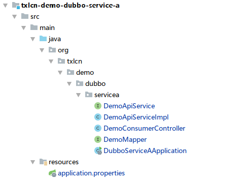
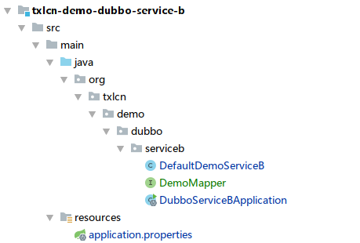
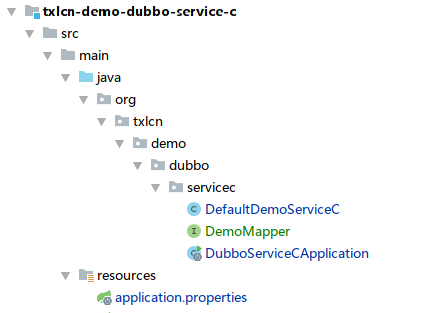

# Dubbo示例

Dubbo 示例说明  
共三个模块如下：  
DubboServiceA (发起方 | LCN模式)     
DubboServiceB (参与方 | TXC模式)  
DubboServiceC (参与方 | TCC模式)  

代码地址:https://github.com/codingapi/txlcn-demo

## 一、调用关系说明:

1. DubboServiceA -> DemoConsumerController的`txlcn`的Mapping是调用发起方法，代码如下。
```java
@RestController
public class DemoConsumerController {


    @Autowired
    private DemoApiService demoApiService;


    @RequestMapping("/txlcn")
        public String sayHello(@RequestParam("value") String value,
                               @RequestParam(value = "ex", required = false) String exFlag) {
            return demoApiService.execute(value, exFlag);
        }

}

```
2. DemoApiService.execute(value, exFlag)方法代码:
```java
@Service
public class DemoApiServiceImpl implements DemoApiService {

    @Reference(version = "${demo.service.version}",
            application = "${dubbo.application.b}",
            registry = "${dubbo.registry.address}",
            retries = -1,
            check = false,
            loadbalance = "txlcn_random")
    private DemoServiceB demoServiceB;

    @Reference(version = "${demo.service.version}",
            application = "${dubbo.application.c}",
            retries = -1,
            check = false,
            registry = "${dubbo.registry.address}",
            loadbalance = "txlcn_random")
    private DemoServiceC demoServiceC;

    @Autowired
    private DemoMapper demoMapper;

    @Override
    @LcnTransaction
    public String execute(String name, String exFlag) {
        String bResp = demoServiceB.rpc(name);
        String cResp = demoServiceC.rpc(name);
        Demo demo = new Demo();
        demo.setGroupId(TracingContext.tracing().groupId());
        demo.setDemoField(name);
        demo.setAppName(Transactions.getApplicationId());
        demo.setCreateTime(new Date());
        demoMapper.save(demo);

        if (Objects.nonNull(exFlag)) {
            throw new IllegalStateException("by exFlag");
        }
        return bResp + " > " + cResp + " > " + "ok-service-a";
    }
}


```
3. 参与方DemoServiceB.rpc(name)的代码

```java
@Service(
        version = "${demo.service.version}",
        application = "${dubbo.application.id}",
        protocol = "${dubbo.protocol.id}",
        registry = "${dubbo.registry.id}"
)
@Slf4j
public class DefaultDemoService implements DDemoService {

    @Autowired
    private DemoMapper demoMapper;

    @Override
    @TxTransaction(type = "txc")
    public String rpc(String name) {
        Demo demo = new Demo();
        demo.setDemoField(name);
        demo.setGroupId(TracingContext.tracing().groupId());
        demo.setCreateTime(new Date());
        demo.setAppName(Transactions.getApplicationId());
        demoMapper.save(demo);
        return "ok-service-d";
    }

}

```

4. 参与方DemoServiceC.rpc(name)的代码
```java
@Service(
        version = "${demo.service.version}",
        application = "${dubbo.application.id}",
        protocol = "${dubbo.protocol.id}",
        registry = "${dubbo.registry.id}"
)
@Slf4j
public class DefaultDemoService implements EDemoService {

    @Autowired
    private DemoMapper demoMapper;

    private ConcurrentHashMap<String, Long> ids = new ConcurrentHashMap<>();

    @Override
    @TccTransaction(confirmMethod = "cm", cancelMethod = "cl", executeClass = DefaultDemoService.class)
    public String rpc(String name) {
        Demo demo = new Demo();
        demo.setDemoField(name);
        demo.setAppName(Transactions.getApplicationId());
        demo.setCreateTime(new Date());
        demo.setGroupId(TracingContext.tracing().groupId());
        demoMapper.save(demo);
        ids.put(TracingContext.tracing().groupId(), demo.getId());
        return "ok-service-c";
    }

    public void cm(String name) {
        log.info("tcc-confirm-" + TracingContext.tracing().groupId());
        ids.remove(TracingContext.tracing().groupId());
    }

    public void cl(String name) {
        log.info("tcc-cancel-" + TracingContext.tracing().groupId());
        demoMapper.deleteByKId(ids.get(TracingContext.tracing().groupId()));
    }
}

```

## 二、工程代码概览
1. 事务发起方，txlcn-demo-dubbo-service-a
* 工程截图   
  
* 项目配置文件 application.properties     
```properties
##################
# 这个是启动本服务的配置文件，其它的application-xxx.properties 是开发者的个性化配置，不用关心。
# 你可以在 https://txlcn.org/zh-cn/docs/setting/client.html 看到所有的个性化配置
#################

# Spring boot application
spring.application.name=DubboServiceAApplication
server.port=12004
management.port=12007

# Service Version
demo.service.version=1.0.0

# Dubbo Config properties
## ApplicationConfig Bean
dubbo.application.id=DubboServiceAApplication
dubbo.application.name=DubboServiceAApplication
dubbo.application.b=DubboServiceBApplication
dubbo.application.c=DubboServiceCApplication

## ProtocolConfig Bean
dubbo.protocol.id=dubbo
dubbo.protocol.name=dubbo
dubbo.protocol.port=12345
dubbo.registry.protocol=zookeeper
dubbo.registry.address=127.0.0.1:2181


spring.datasource.driver-class-name=com.mysql.jdbc.Driver
spring.datasource.url=jdbc:mysql://127.0.0.1:3306/txlcn-demo?\
  characterEncoding=UTF-8&serverTimezone=UTC
spring.datasource.username=root
spring.datasource.password=root
spring.datasource.hikari.maximum-pool-size=20
mybatis.configuration.map-underscore-to-camel-case=true
mybatis.configuration.use-generated-keys=true

logging.level.com.codingapi.txlcn=DEBUG

```
* 启动类
```java
@SpringBootApplication
@EnableDistributedTransaction
public class DubboServiceAApplication {

    public static void main(String[] args) {
        SpringApplication.run(DubboServiceAApplication.class, args);
    }
}

```

2. 事务参与方，txlcn-demo-dubbo-service-b
* 工程截图  
     
* 项目配置文件 application.properties  
```properties
##################
# 这个是启动本服务的配置文件，其它的application-xxx.properties 是开发者的个性化配置，不用关心。
# 你可以在 https://txlcn.org/zh-cn/docs/setting/client.html 看到所有的个性化配置
#################

# Spring boot application
spring.application.name=DubboServiceBApplication
server.port=12005
management.port=12008

# Service version
demo.service.version=1.0.0

# Base packages to scan Dubbo Components (e.g @Service , @Reference)
dubbo.scan.basePackages=com.example

# Dubbo Config properties
## ApplicationConfig Bean
dubbo.application.id=DubboServiceBApplication
dubbo.application.name=DubboServiceBApplication

## ProtocolConfig Bean
dubbo.protocol.id=dubbo
dubbo.protocol.name=dubbo
dubbo.protocol.port=12345

## RegistryConfig Bean
dubbo.registry.id=my-registry
dubbo.registry.address=127.0.0.1:2181
dubbo.registry.protocol=zookeeper
dubbo.application.qos.enable=false

## DB
spring.datasource.driver-class-name=com.mysql.jdbc.Driver
spring.datasource.url=jdbc:mysql://127.0.0.1:3306/txlcn-demo?\
  characterEncoding=UTF-8&serverTimezone=UTC
spring.datasource.username=root
spring.datasource.password=root
spring.datasource.hikari.maximum-pool-size=20
mybatis.configuration.map-underscore-to-camel-case=true
mybatis.configuration.use-generated-keys=true

logging.level.com.codingapi.txlcn=DEBUG

```
* 启动类
```java
@SpringBootApplication
@EnableDistributedTransaction
public class DubboServiceBApplication {

    public static void main(String[] args) {
        SpringApplication.run(DubboServiceBApplication.class, args);
    }
}

```
3. 事务参与方，txlcn-demo-spring-service-c
* 工程截图  
  
* 项目配置文件 application.properties  
```properties
##################
# 这个是启动本服务的配置文件，其它的application-xxx.properties 是开发者的个性化配置，不用关心。
# 你可以在 https://txlcn.org/zh-cn/docs/setting/client.html 看到所有的个性化配置
#################

# Spring boot application
spring.application.name=DubboServiceCApplication
server.port=12006
management.port=12009

# Service version
demo.service.version=1.0.0

# Base packages to scan Dubbo Components (e.g @Service , @Reference)
dubbo.scan.basePackages=org.txlcn.demo.dubbo

# Dubbo Config properties
## ApplicationConfig Bean
dubbo.application.id=DubboServiceCApplication
dubbo.application.name=DubboServiceCApplication

## ProtocolConfig Bean
dubbo.protocol.id=dubbo
dubbo.protocol.name=dubbo
dubbo.protocol.port=12346

## RegistryConfig Bean
dubbo.registry.id=my-registry
dubbo.registry.address=127.0.0.1:2181
dubbo.registry.protocol=zookeeper

dubbo.application.qos.enable=false

#db
spring.datasource.driver-class-name=com.mysql.jdbc.Driver
spring.datasource.url=jdbc:mysql://127.0.0.1:3306/txlcn-demo\
  ?characterEncoding=UTF-8&serverTimezone=UTC
spring.datasource.username=root
spring.datasource.password=root
spring.datasource.hikari.maximum-pool-size=20

mybatis.configuration.map-underscore-to-camel-case=true
mybatis.configuration.use-generated-keys=true

logging.level.com.codingapi.txlcn=DEBUG

```
* 启动类
```java
@SpringBootApplication
@EnableDistributedTransaction
public class DubboServiceCApplication {

    public static void main(String[] args) {
        SpringApplication.run(DubboServiceCApplication.class, args);
    }
}

```

## 三、启动SpringCloud微服务
事务参与方 ServiceB  

事务参与方 ServiceC  

事务发起方 ServiceA  

