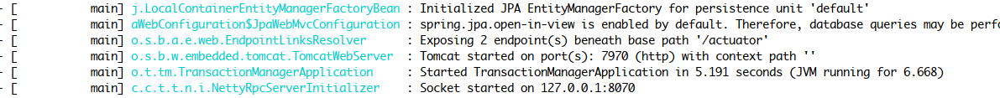
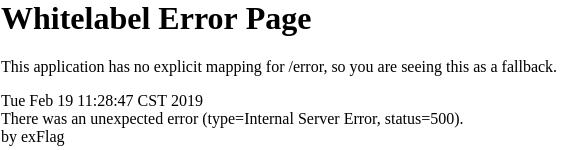

# 尝试下简单的分布式事务

## 步骤引导

1. 阅读[快速开始](/zh-cn/docs/start.html)

2. 准备开发环境
    JDK1.8+, Mysql5.6+, Redis3.2+, Consul(SpringCloud), ZooKeeper(Dubbo), Git, Maven
    
3. 初始化数据
    
4. 启动TxManager(TM)  
    
5. 配置微服务模块  
   
6. 启动模块与测试  


## 3. 初始化数据
> 为了演示方便，我们接下来3个微服务用一个数据库，一张数据表。

1. 创建MySQL数据库
```
create database if not exists `txlcn-demo` default charset utf8 collate utf8_general_ci;
```
2. 创建数据表
         
```
create table `t_demo` (
  `id` bigint(20) NOT NULL AUTO_INCREMENT,
  `kid` varchar(45) DEFAULT NULL,
  `group_id` varchar(64) DEFAULT NULL,
  `demo_field` varchar(255) DEFAULT NULL,
  `app_name` varchar(128) DEFAULT NULL,
  `create_time` datetime DEFAULT NULL,
  PRIMARY KEY (`id`)
) ENGINE=InnoDB DEFAULT CHARSET=utf8 ROW_FORMAT=DYNAMIC;
```
## 4. 启动TxManager(TM)
TM启动详情，见[快速启动](/zh-cn/docs/start.html)  
这里介绍如何在开发环境友好启动TM.  
1. 新建SpringBoot模块  
2. 新增依赖  
```xml
<dependency>
    <groupId>com.codingapi.txlcn</groupId>
    <artifactId>txlcn-tm</artifactId>
    <version>5.0.2.RELEASE</version>
</dependency>
```
3. 在主类上标注 @EnableTransactionManagerServer
```java
@SpringBootApplication
@EnableTransactionManagerServer
public class TransactionManagerApplication {

  public static void main(String[] args) {
      SpringApplication.run(TransactionManagerApplication.class, args);
  }

}
```
4. 运行DemoTransactionManager



## 5. 配置微服务模块 

Dubbo Demo见[Dubbo-Demo](dubbo.html)

SpringCloud Demo见[SpringCloud-Demo](springcloud.html)


## 6. 启动模块与测试  
1. 正常提交事务  
访问 发起方提供的Rest接口 `/txlcn?value=the-value`。发现事务全部提交  


2. 回滚事务  
访问 发起方提供的Rest接口 `/txlcn?value=the-value&ex=throw`。发现发起方由本地事务回滚，而参与方ServiceB、ServiceC，由于TX-LCN的协调，数据也回滚了。  

